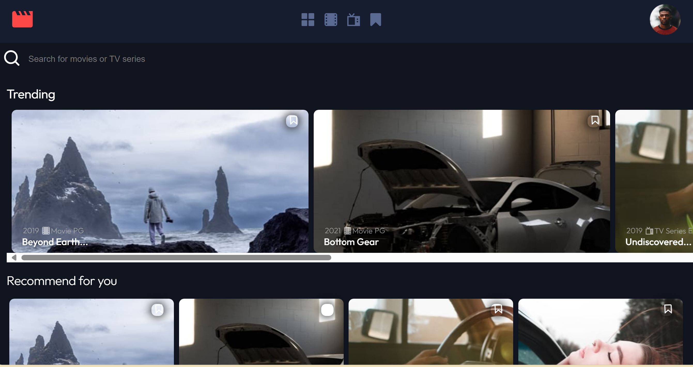
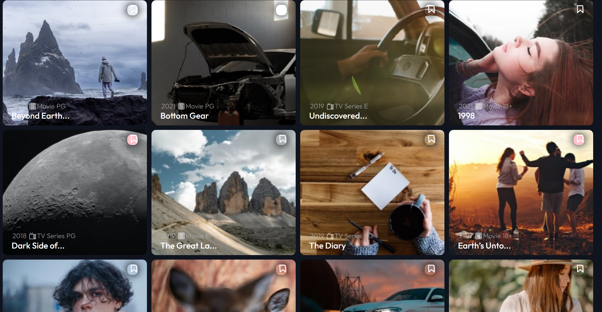

It looks like you’ve shared a detailed project brief for an "Entertainment Web App" challenge, likely from Frontend Mentor or a similar platform. Since your previous questions were about creating a Git README and adding images (`netflixcopy.png` and `netflixcopy2.png`), I’ll assume you want me to craft a custom `README.md` for this specific project, incorporating an "Images" section with those image names. I’ll adapt the provided template into an innovative README that reflects the project and includes your requested images.

Below is the custom `README.md`:

---

# Entertainment Web App 🎬



Welcome to my **Entertainment Web App**! This project is a fully responsive web application designed to browse movies, TV series, and bookmarked shows, built as part of a coding challenge to sharpen my skills in HTML, CSS, and JavaScript. Inspired by real-world streaming platforms, it’s a portfolio-worthy piece that showcases both design fidelity and functional interactivity.

---

## 🌟 Project Overview

This app lets users explore a collection of entertainment content with a sleek, intuitive interface. Key features include:

- **Responsive Design**: Adapts seamlessly across devices—mobile, tablet, and desktop.
- **Navigation**: Fixed sidebar menu on larger screens, with pages for Home, Movies, TV Series, and Bookmarked Shows.
- **Search Functionality**: Search across all content or filter by category.
- **Bookmarks**: Add or remove bookmarks for movies and TV series.
- **Trending Section**: A horizontally scrollable showcase of trending shows.

**Tech Stack**: HTML, CSS, JavaScript  
**Data Source**: Local `data.json` file

---

## 🎯 Features & Behavior

Here’s what users can do:

- **Home**: Browse trending shows (scrollable) and search all content.
- **Movies**: View and search only "Movie" category items.
- **TV Series**: View and search only "TV Series" category items.
- **Bookmarked Shows**: See all bookmarked content with search functionality.
- **Interactivity**: Hover states for buttons and interactive elements.
- **Bonus Goal**: Potential for a full-stack version with auth screens (not implemented yet).

---

## 📸 Images

Check out some screenshots of the app in action:

| Description            | Screenshot                           |
|------------------------|--------------------------------------|
| Homepage Layout        |   |
| Movie Details View     |  |

*Images are stored in the `images/` folder of this repository.*

---

## 🛠️ Getting Started

Want to run this project locally? Follow these steps:

1. **Clone the Repository**  
   ```bash
   git clone https://github.com/yourusername/entertainment-web-app.git
   ```

2. **Navigate to the Project**  
   ```bash
   cd entertainment-web-app
   ```

3. **Open the App**  
   Open `index.html` in your browser to explore the app. No additional setup is required since it’s frontend-only for now!

---


## 🧠 What I Learned

- **Responsive Design**: Mastered CSS Grid and Flexbox for dynamic layouts.
- **JavaScript Logic**: Built search and bookmark functionality from scratch.
- **Design Fidelity**: Translated Figma/Sketch designs into pixel-perfect code.
- **Workflow**: Improved my process of structuring HTML before styling.

---

## 🔮 Future Enhancements

- Add full-stack functionality with a backend (e.g., Node.js, Express).
- Implement user authentication (sign-up/login flow).
- Enhance search with real-time filtering and suggestions.

---
